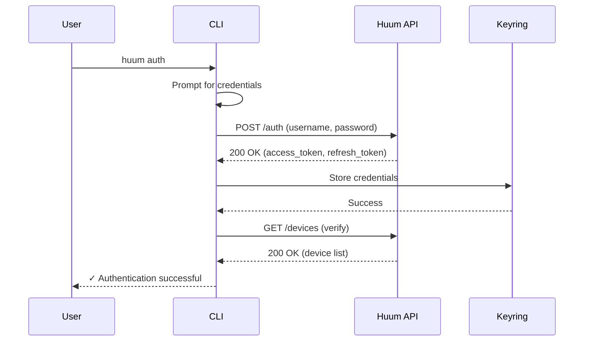
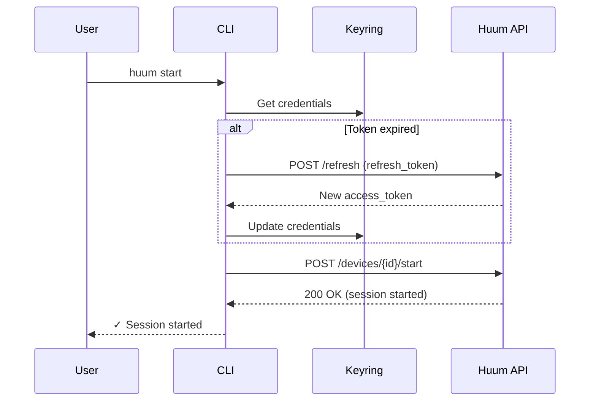

# CLI Command Contracts: Huum Sauna CLI Manager

**Date**: 2025-10-08
**Feature**: 001-a-simple-cli
**Purpose**: Define all CLI commands, their arguments, options, outputs, and behaviors

## Overview

This document specifies the complete contract for all CLI commands in the Huum Sauna CLI application. Each command includes argument specifications, expected outputs, exit codes, and error handling behavior.

---

## Global Options

Available for all commands:

| Option | Short | Type | Default | Description |
|--------|-------|------|---------|-------------|
| `--help` | `-h` | flag | - | Show help message and exit |
| `--version` | `-v` | flag | - | Show CLI version and exit |
| `--format` | `-f` | choice | `human` | Output format: `human`, `json` |
| `--verbose` | - | flag | false | Enable verbose output with debug info |

---

## Commands

### 1. `auth` - Authenticate with Huum Account

**Purpose**: Authenticate user with Huum account credentials and store tokens securely.

**Usage**:
```bash
huum auth [OPTIONS]
huum auth --username user@example.com --password mypassword
huum auth  # Interactive prompt for credentials
```

**Arguments**: None

**Options**:

| Option | Short | Type | Required | Description |
|--------|-------|------|----------|-------------|
| `--username` | `-u` | string | No | Huum account username/email |
| `--password` | `-p` | string | No | Huum account password |
| `--interactive` | `-i` | flag | No | Force interactive credential prompt (default if no options) |

**Behavior**:
1. If `--username` and `--password` provided, use them directly
2. If either missing, prompt interactively (hide password input)
3. Make authentication request to Huum API
4. Store tokens securely using OS keyring
5. Verify authentication by fetching device list

**Success Output** (human format):
```
✓ Authentication successful!
✓ Credentials stored securely
✓ Found 2 sauna device(s)
```

**Success Output** (json format):
```json
{
  "status": "success",
  "message": "Authentication successful",
  "devices_found": 2
}
```

**Error Cases**:

| Scenario | Exit Code | Error Message |
|----------|-----------|---------------|
| Invalid credentials | 1 | `Error: Invalid username or password` |
| Network error | 2 | `Error: Cannot reach Huum API. Check internet connection.` |
| Already authenticated | 0 | `Warning: Already authenticated. Use 'huum auth --force' to re-authenticate.` |
| Keyring unavailable | 3 | `Error: Cannot access system keyring. Credentials cannot be stored securely.` |

**Exit Codes**: 0 (success), 1 (auth failure), 2 (network error), 3 (storage error)

---

### 2. `start` - Start Sauna Session

**Purpose**: Start heating a sauna to target temperature.

**Usage**:
```bash
huum start [DEVICE_ID] [OPTIONS]
huum start --temperature 85
huum start my-sauna --temperature 90
```

**Arguments**:

| Argument | Type | Required | Description |
|----------|------|----------|-------------|
| `device_id` | string | No | Device ID or name to control (required if multiple devices) |

**Options**:

| Option | Short | Type | Default | Description |
|--------|-------|------|---------|-------------|
| `--temperature` | `-t` | integer | 85 | Target temperature in Celsius (40-110) |

**Behavior**:
1. Verify authentication (prompt if not authenticated)
2. If no `device_id` provided and single device exists, auto-select
3. If no `device_id` provided and multiple devices exist, show error
4. Validate temperature is within safe range (40-110°C)
5. Check device is online
6. Check no active session exists
7. Send start command to Huum API
8. Display confirmation with session details

**Success Output** (human format):
```
✓ Starting sauna: Home Sauna
  Target temperature: 85°C
  Current temperature: 22°C
  Estimated time to ready: ~45 minutes

✓ Session started successfully
```

**Success Output** (json format):
```json
{
  "status": "success",
  "device_id": "huum-abc123",
  "device_name": "Home Sauna",
  "target_temperature": 85,
  "current_temperature": 22,
  "estimated_minutes": 45,
  "session_id": "session-xyz789"
}
```

**Error Cases**:

| Scenario | Exit Code | Error Message |
|----------|-----------|---------------|
| Not authenticated | 1 | `Error: Not authenticated. Run 'huum auth' first.` |
| Multiple devices, no ID | 1 | `Error: Multiple devices found. Specify device_id. Use 'huum list' to see devices.` |
| Device not found | 1 | `Error: Device 'my-sauna' not found` |
| Device offline | 2 | `Error: Device 'Home Sauna' is offline` |
| Session already active | 1 | `Error: Session already active. Stop current session first with 'huum stop'.` |
| Invalid temperature | 1 | `Error: Temperature 120°C outside safe range (40-110°C)` |
| API error | 2 | `Error: Failed to start session: {api_error_message}` |

**Exit Codes**: 0 (success), 1 (validation error), 2 (API/device error)

---

### 3. `stop` - Stop Sauna Session

**Purpose**: Stop an active sauna heating session.

**Usage**:
```bash
huum stop [DEVICE_ID]
huum stop
huum stop my-sauna
```

**Arguments**:

| Argument | Type | Required | Description |
|----------|------|----------|-------------|
| `device_id` | string | No | Device ID or name to control (required if multiple devices) |

**Options**: None (uses global options only)

**Behavior**:
1. Verify authentication
2. Auto-select device if only one exists
3. Check device is online
4. Send stop command to Huum API
5. Display confirmation with session summary

**Success Output** (human format):
```
✓ Stopping sauna: Home Sauna

Session Summary:
  Duration: 1 hour 15 minutes
  Max temperature reached: 87°C

✓ Session stopped successfully
```

**Success Output** (json format):
```json
{
  "status": "success",
  "device_id": "huum-abc123",
  "device_name": "Home Sauna",
  "session_duration_minutes": 75,
  "max_temperature": 87
}
```

**Error Cases**:

| Scenario | Exit Code | Error Message |
|----------|-----------|---------------|
| Not authenticated | 1 | `Error: Not authenticated. Run 'huum auth' first.` |
| Multiple devices, no ID | 1 | `Error: Multiple devices found. Specify device_id.` |
| Device not found | 1 | `Error: Device 'my-sauna' not found` |
| No active session | 1 | `Warning: No active session for device 'Home Sauna'` |
| Device offline | 2 | `Error: Device 'Home Sauna' is offline` |
| API error | 2 | `Error: Failed to stop session: {api_error_message}` |

**Exit Codes**: 0 (success), 1 (validation error), 2 (API/device error)

---

### 4. `status` - Check Sauna Status

**Purpose**: Display current status of one or all sauna devices.

**Usage**:
```bash
huum status [DEVICE_ID]
huum status           # Show all devices
huum status my-sauna  # Show specific device
```

**Arguments**:

| Argument | Type | Required | Description |
|----------|------|----------|-------------|
| `device_id` | string | No | Device ID or name (if omitted, shows all devices) |

**Options**:

| Option | Short | Type | Default | Description |
|--------|-------|------|---------|-------------|
| `--watch` | `-w` | flag | false | Continuously update status (refresh every 5s) |
| `--refresh` | `-r` | integer | 5 | Refresh interval in seconds (with --watch) |

**Behavior**:
1. Verify authentication
2. If `device_id` provided, fetch that device status
3. If no `device_id`, fetch all devices status
4. Display current temperature, target, heating state, session info
5. If `--watch` enabled, refresh continuously until Ctrl+C

**Success Output - Single Device** (human format):
```
Home Sauna (huum-abc123)
━━━━━━━━━━━━━━━━━━━━━━━━━━━━━━━━━
Status:        Online
Session:       Active (1h 15m)
Current:       84°C
Target:        85°C
Heating:       Yes
Progress:      [████████████████████░░] 95%

Estimated time to ready: ~3 minutes
```

**Success Output - Multiple Devices** (human format):
```
Your Sauna Devices
━━━━━━━━━━━━━━━━━━━━━━━━━━━━━━━━━

Home Sauna (huum-abc123)
  Status: Online | Session: Active
  Current: 84°C → Target: 85°C

Cabin Sauna (huum-def456)
  Status: Online | Session: Idle
  Current: 23°C
```

**Success Output** (json format):
```json
{
  "status": "success",
  "devices": [
    {
      "device_id": "huum-abc123",
      "name": "Home Sauna",
      "online": true,
      "current_temperature": 84,
      "target_temperature": 85,
      "heating_state": "heating",
      "session_active": true,
      "session_duration_minutes": 75,
      "estimated_minutes_remaining": 3
    }
  ]
}
```

**Error Cases**:

| Scenario | Exit Code | Error Message |
|----------|-----------|---------------|
| Not authenticated | 1 | `Error: Not authenticated. Run 'huum auth' first.` |
| Device not found | 1 | `Error: Device 'my-sauna' not found` |
| No devices configured | 1 | `Error: No sauna devices found for your account` |
| API error | 2 | `Error: Failed to fetch status: {api_error_message}` |

**Exit Codes**: 0 (success), 1 (validation error), 2 (API error)

---

### 5. `list` - List Available Devices

**Purpose**: Display all sauna devices associated with the authenticated account.

**Usage**:
```bash
huum list
```

**Arguments**: None

**Options**: None (uses global options only)

**Behavior**:
1. Verify authentication
2. Fetch all devices from Huum API
3. Display device list with ID, name, and online status

**Success Output** (human format):
```
Your Sauna Devices
━━━━━━━━━━━━━━━━━━━━━━━━━━━━━━━━━

1. Home Sauna
   ID: huum-abc123
   Status: Online

2. Cabin Sauna
   ID: huum-def456
   Status: Offline (last seen 2 days ago)

Total: 2 devices
```

**Success Output** (json format):
```json
{
  "status": "success",
  "devices": [
    {
      "device_id": "huum-abc123",
      "name": "Home Sauna",
      "online": true,
      "last_seen": "2025-10-08T14:32:10Z"
    },
    {
      "device_id": "huum-def456",
      "name": "Cabin Sauna",
      "online": false,
      "last_seen": "2025-10-06T10:15:30Z"
    }
  ],
  "total": 2
}
```

**Error Cases**:

| Scenario | Exit Code | Error Message |
|----------|-----------|---------------|
| Not authenticated | 1 | `Error: Not authenticated. Run 'huum auth' first.` |
| No devices found | 0 | `No sauna devices found for your account. Add devices in the Huum mobile app.` |
| API error | 2 | `Error: Failed to fetch devices: {api_error_message}` |

**Exit Codes**: 0 (success, including no devices case), 1 (auth error), 2 (API error)

---

### 6. `config` - Manage Configuration

**Purpose**: View or modify CLI configuration settings.

**Usage**:
```bash
huum config                          # Show all configuration
huum config get default_temperature  # Get specific setting
huum config set default_temperature 85
huum config set default_device huum-abc123
huum config reset                    # Reset to defaults
```

**Arguments**:

| Argument | Type | Required | Description |
|----------|------|----------|-------------|
| `action` | choice | No | Action: `get`, `set`, `reset` (default: show all) |
| `key` | string | No | Configuration key (required for get/set) |
| `value` | string | No | Configuration value (required for set) |

**Options**: None (uses global options only)

**Configurable Settings**:

| Key | Type | Default | Description |
|-----|------|---------|-------------|
| `default_device` | string | None | Default device ID when multiple exist |
| `default_temperature` | integer | 85 | Default target temperature |
| `output_format` | choice | `human` | Default output format: `human`, `json` |
| `auto_refresh` | boolean | false | Auto-refresh status after start command |

**Behavior**:
- `config` (no args): Display all settings
- `config get <key>`: Display specific setting value
- `config set <key> <value>`: Update setting value
- `config reset`: Reset all settings to defaults

**Success Output** - Show All (human format):
```
Huum CLI Configuration
━━━━━━━━━━━━━━━━━━━━━━━━━━━━━━━━━

default_device:       huum-abc123
default_temperature:  85°C
output_format:        human
auto_refresh:         false

Config file: ~/.config/huum-cli/config.json
```

**Success Output** - Get Setting (human format):
```
default_temperature: 85
```

**Success Output** - Set Setting (human format):
```
✓ Configuration updated: default_temperature = 85
```

**Success Output** (json format):
```json
{
  "status": "success",
  "action": "set",
  "key": "default_temperature",
  "value": 85
}
```

**Error Cases**:

| Scenario | Exit Code | Error Message |
|----------|-----------|---------------|
| Unknown key | 1 | `Error: Unknown configuration key 'foo'. Valid keys: default_device, default_temperature, output_format, auto_refresh` |
| Invalid value type | 1 | `Error: Invalid value for 'default_temperature': must be integer 40-110` |
| Missing argument | 1 | `Error: 'set' requires both key and value arguments` |
| File permission error | 3 | `Error: Cannot write to config file. Check permissions.` |

**Exit Codes**: 0 (success), 1 (validation error), 3 (file error)

---

### 7. `logout` - Clear Authentication

**Purpose**: Remove stored credentials and log out.

**Usage**:
```bash
huum logout
huum logout --force  # Skip confirmation
```

**Arguments**: None

**Options**:

| Option | Short | Type | Default | Description |
|--------|-------|------|---------|-------------|
| `--force` | `-f` | flag | false | Skip confirmation prompt |

**Behavior**:
1. Prompt for confirmation (unless `--force`)
2. Delete credentials from keyring
3. Clear any cached data
4. Display confirmation

**Success Output** (human format):
```
Are you sure you want to log out? [y/N]: y
✓ Logged out successfully
✓ Credentials removed from secure storage
```

**Success Output** (json format):
```json
{
  "status": "success",
  "message": "Logged out successfully"
}
```

**Error Cases**:

| Scenario | Exit Code | Error Message |
|----------|-----------|---------------|
| Not authenticated | 0 | `Not currently authenticated.` |
| Keyring error | 3 | `Warning: Could not access keyring. Credentials may still exist.` |

**Exit Codes**: 0 (success or already logged out), 3 (keyring error)

---

## Global Exit Codes

Standard exit codes used across all commands:

| Exit Code | Meaning | Usage |
|-----------|---------|-------|
| 0 | Success | Command completed successfully |
| 1 | Validation Error | Invalid arguments, missing required data, business logic error |
| 2 | API/Network Error | Cannot reach API, API returned error, device communication failed |
| 3 | Storage Error | Cannot access keyring or config file |
| 130 | Interrupted | User pressed Ctrl+C (SIGINT) |

---

## Error Message Format

All error messages follow consistent formatting:

**Human Format**:
```
Error: <clear description of what went wrong>
<optional suggestion for resolution>
```

**JSON Format**:
```json
{
  "status": "error",
  "error_code": "AUTH_REQUIRED",
  "message": "Not authenticated. Run 'huum auth' first.",
  "suggestions": ["Run 'huum auth' to authenticate"]
}
```

---

## Output Format Examples

### Human Format

**Design Principles**:
- Clear, colored output using Rich library
- Progress bars for heating status
- Tables for device lists
- Friendly, conversational messages
- Emoji/symbols for status indicators (✓, ✗, ⚠)

### JSON Format

**Design Principles**:
- Valid JSON on stdout
- Consistent structure: `{"status": "success|error", ...}`
- All errors on stderr (not captured in JSON)
- Include machine-readable status codes
- ISO 8601 timestamps
- Suitable for scripting and automation

---

## Authentication Flow



## Command Execution Flow



---

## References

- Feature Spec: [spec.md](../spec.md) - User scenarios and requirements
- Data Model: [data-model.md](../data-model.md) - Entity definitions
- Research: [research.md](../research.md) - Technology choices (Typer, httpx)
